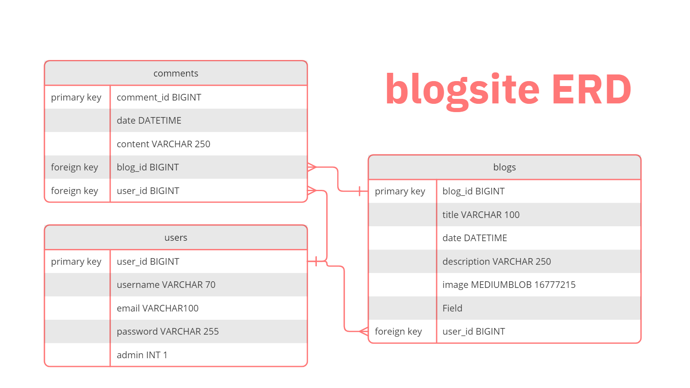
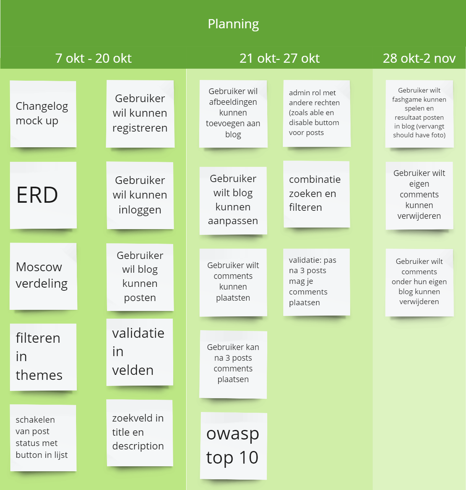

# Changelog

---

## Over dit project
Dit project is gebouwd met Laravel 11 en p5.js.

---
### 09/10/2024
Project gestart en Breeze toegevoegd.
#### Toegevoegd
- **Testpagina's**: about-us, test, home, contact
- **Testcontrollers**: AboutUsController, HomeController, ContactController
- **Changelog**: Bestand toegevoegd met mock-up voor changelogs.
- **ERD, MoSCoW, and planning**: Ik heb een MoSCoW-indeling en plannig gemaakt, die zie je hier:
- 

- 

- 

FOTO MOSCOW
FOTO PLANNING
FOTO ERD
#### Gewijzigd
- **web.php**: Routes toegevoegd voor testpagina's en controllers.

### Bron
[Laracast Laravel 11 Episode 1](https://laracasts.com/series/30-days-to-learn-laravel-11/episodes/1)  
[Laracast Laravel 11 Episode 2](https://laracasts.com/series/30-days-to-learn-laravel-11/episodes/2)

---
### 14/10/2024
#### Toegevoegd
- **Dress-up Flashgame**: Placeholder personage en kleding in public, logica voor aan- en uitkleden in canvas.blade.php. Opmerkingen toegevoegd voor leesbaarheid. game.js toegevoegd voor toekomstige logica.
- **Een navigatiebalk**: Toegevoegd in contact.blade.php en about-us.blade.php.

#### Gewijzigd
- **web.php**: Route toegevoegd voor canvas.blade.php.
- **layout.blade.php**: canvas.blade.php toegevoegd aan navigatiebalk.
- **ERD**: Ik heb feedback van Bob gekregen op mijn ERD. Dat was om een losse tabel voor de thema's te maken. Dat ik nog geen manier had om blogs actief en inactief kunnen maken door de admins. En de id in een tabel gewoon id te noemen, inplaats van bijvoorbeeld user_id. Hieronder zie je de nieuwe ERD.
FOTO NIEUWE ERD

#### Opgelost
- **home.blade.php en layout.blade.php**: Content van home staat correct in home en routing werkt.

### Bron
[P5.js Startgids](https://p5js.org/tutorials/get-started/)  
[P5.js draw](https://p5js.org/reference/p5/draw/)  
[P5.js mousePressed](https://p5js.org/reference/p5/mousePressed/)  
[P5.js loadImage](https://p5js.org/reference/p5/loadImage/)  
[P5.js save image](https://p5js.org/reference/p5.Image/save/)  
[Laracast Laravel 11 Episode 3](https://laracasts.com/series/30-days-to-learn-laravel-11/episodes/3)

---
### 16/10/2024
#### Toegevoegd
- **Items voor dress-up game**: Placeholder items in public en logica toegevoegd in canvas.blade.php.
- **navlink-cast5.blade.php**: Gemaakt voor navigatielinks met actieve pagina-highlighting.

#### Gewijzigd
- **web.php**: Route toegevoegd voor canvas.blade.php.

#### Opgelost
- **home.blade.php en layout.blade.php**: Routing en controllers werken correct.

### Bron
[Laracast Laravel 11 Episode 4](https://laracasts.com/series/30-days-to-learn-laravel-11/episodes/4)  
[Laracast Laravel 11 Episode 5](https://laracasts.com/series/30-days-to-learn-laravel-11/episodes/5)

---
### 17/10/2024
#### Toegevoegd
- **Blog-, Thema- en Reactiefuncties**:
    - Controllers, modellen en migraties gemaakt.
    - Blog: `index.blade.php` (blogoverzicht) en `show.blade.php` (details).
    - Thema: `create.blade.php` voor nieuwe thema’s.
    - Reacties: Begin gemaakt met tonen en toevoegen van reacties. Relaties in modellen bijgewerkt.

#### Gewijzigd
- **web.php**: Routes toegevoegd voor nieuwe functies.
- **Navigatiebalk**: Breeze-navigatie gebruikt in plaats van eigen versie.

### Bron
[Eloquent Relationships Documentatie](https://laravel.com/docs/11.x/eloquent-relationships)  
[Laracast Laravel 11 Episode 11](https://laracasts.com/series/30-days-to-learn-laravel-11/episodes/11)

---
### 18/10/2024
#### Toegevoegd
- **Updates Dress-up Game**: Hoeden en andere items toegevoegd als placeholders.
- **Navigatie-updates**: Logo bijgewerkt in `navigation.blade.php`.

---
### 22/10/2024
#### Toegevoegd
- **Post maken**: Formulier voor het aanmaken van posts in `BlogController.php`, updates in navigatie en routes.
- **Gebruikerskoppeling aan blogs**: `user_id` toegevoegd aan blogs om de maker te volgen. Styling van `index.blade.php` gestart.

---
### 07/11/2024
#### Toegevoegd
- **Dress-up Game Assets**: Personage, mannequin en kleding toegevoegd in `public/images/game`. Bijgewerkt in `game_partial.blade.php`.
- **Volgende stappen**: "Outfit afronden"-knop gepland om door te sturen naar blogaanmaak met outfit-afbeelding.

---
### 08/11/2024
#### Opgelost
- **Rollen en Middleware**: Roltoewijzing (gebruiker/admin) geïmplementeerd. Routingproblemen opgelost via middleware in `bootstrap/app.php`.

---
### 09/11/2024
#### Toegevoegd
- **Admin Rol Functies**: Routing, controllers, views en navigatie voor admin.

#### Opgelost
- **Gebruikersrouting**: Problemen met gebruikerspagina's debugged.

---
### 11/11/2024
#### Toegevoegd
- **Auteursnaam tonen**: Blogauteursnamen weergegeven met geüpdatete modellen en controllers.
- **CRUD-updates**: Focus op CRUD-functionaliteiten voor blogs en reacties.

---
### 13/11/2024
#### Toegevoegd
- **Blog bewerken**: `edit.blade.php` en logica in `BlogController.php` en `AppServiceProvider.php`.
- Validatie toegevoegd voor blog-edit en -aanmaak (titel en beschrijving verplicht). Breeze valideert bijvoorbeeld e-mailadressen bij login.
- VALIDATIE VOOR AFBEELDINGEN.

#### Gewijzigd
- **Views**: Bewerken-knop verplaatst naar `show.blade.php`.

---
### 14/11/2024
#### Opgelost
- **Reacties CRUD**: Toegevoegd en debugged, inclusief policies en views.

---
### 19/11/2024
#### Toegevoegd
- **Gebruikersrestricties**: Alleen reageren als gebruiker drie blogs heeft gepost.
- **Themakeuze**: Functie toegevoegd om thema’s te kiezen bij blogaanmaak.

---
### 23/11/2024
#### Toegevoegd
- **Thema CRUD voor Admin**: CRUD-operaties afgerond en gestyled.

#### Gewijzigd
- **Gebruikersviews**: Kleine stylingaanpassingen.

---
### 24/11/2024
#### Toegevoegd
- **Zoekfunctionaliteit**: Geïmplementeerd in `user.blog.index`.

---
### 26/11/2024
#### Opgelost
- **Probleem met afbeeldingensubmit**: Submit-knop logica voor afbeeldingen opslaan toegevoegd en afgerond in blogs.

### Bron
[Laravel Filesystem](https://laravel.com/docs/11.x/filesystem)  
[W3Schools PHP-functies](https://www.w3schools.com/php/)
