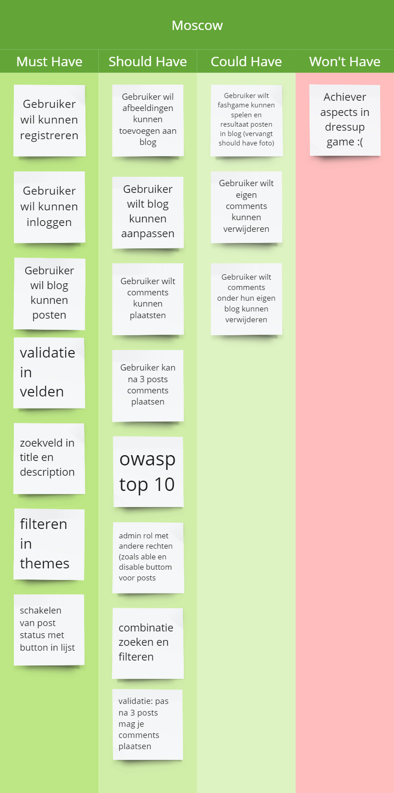

# Changelog

---

## Over dit project
Dit project is gebouwd met Laravel 11 en p5.js.
---
### 07/10/2024
Voordat ik met dit directory begonnen was, heb ik een test opdracht uitgevoerd met een view, controller, en een route in web.php

Dit was wel ingewikkeld omdat ik niet eerder met laravel heb gewerkt, maar met de github pagina met de opdracht en de laracast liep ik nergens tegen aan.
### Bron
[Laracast Laravel 11 Episode 1](https://laracasts.com/series/30-days-to-learn-laravel-11/episodes/1)
https://github.com/HR-CMGT/PRG05-2024-2025/blob/main/instructies/new-project-and-route.md
https://github.com/HR-CMGT/PRG05-2023-2024/blob/main/opdrachten/les3.md#opdracht-1---basisproject-laravel
https://github.com/HR-CMGT/PRG05-2024-2025/blob/main/opdrachten/les1.md
https://github.com/HR-CMGT/PRG05-2024-2025/blob/main/opdrachten/les3.md
https://laravel.com/docs/10.x/routing#route-parameters
https://laravel.com/docs/11.x/controllers
https://laravel.com/docs/11.x/views
https://laravel.com/docs/11.x/blade
https://laravel.com/docs/11.x/urls

---
### 09/10/2024
Project gestart en Breeze toegevoegd.
#### Toegevoegd
- **Testpagina's**: about-us, test, home, contact
- **Testcontrollers**: AboutUsController, HomeController, ContactController
- **Changelog**: Bestand toegevoegd met mock-up voor changelogs.
- **ERD, MoSCoW, and planning**: Ik heb een MoSCoW-indeling en planning gemaakt, die zie je hier:

FOTO MOSCOW
FOTO PLANNING
FOTO ERD
#### Gewijzigd
- **web.php**: Routes toegevoegd voor testpagina's en controllers.

### Bron
[Laracast Laravel 11 Episode 1](https://laracasts.com/series/30-days-to-learn-laravel-11/episodes/1)  
[Laracast Laravel 11 Episode 2](https://laracasts.com/series/30-days-to-learn-laravel-11/episodes/2)

---
### 14/10/2024
#### Toegevoegd
- **Dress-up Flashgame**: Placeholder personage en kleding in public, logica voor aan- en uitkleden in canvas.blade.php. Opmerkingen toegevoegd voor leesbaarheid. game.js toegevoegd voor toekomstige logica.
- **Een navigatiebalk**: Toegevoegd in contact.blade.php en about-us.blade.php.
- Dit is templating (layout)

#### Gewijzigd
- **web.php**: Route toegevoegd voor canvas.blade.php.
- **layout.blade.php**: canvas.blade.php toegevoegd aan navigatiebalk.
- **ERD**: Ik heb feedback van Bob gekregen op mijn ERD. Dat was om een losse tabel voor de thema's te maken. Dat ik nog geen manier had om blogs actief en inactief kunnen maken door de admins. En de id in een tabel gewoon id te noemen, inplaats van bijvoorbeeld user_id. Hieronder zie je de nieuwe ERD.

#### Opgelost
- **home.blade.php en layout.blade.php**: Content van home staat correct in home en routing werkt.

### Bron
[P5.js Startgids](https://p5js.org/tutorials/get-started/)  
[P5.js draw](https://p5js.org/reference/p5/draw/)  
[P5.js mousePressed](https://p5js.org/reference/p5/mousePressed/)  
[P5.js loadImage](https://p5js.org/reference/p5/loadImage/)  
[P5.js save image](https://p5js.org/reference/p5.Image/save/)  
[Laracast Laravel 11 Episode 3](https://laracasts.com/series/30-days-to-learn-laravel-11/episodes/3)
https://laravel.com/docs/11.x/blade

---
### 16/10/2024
#### Toegevoegd
- **Items voor dress-up game**: Placeholder items in public en logica toegevoegd in canvas.blade.php.
- **navlink-cast5.blade.php**: Gemaakt voor navigatielinks met actieve pagina-highlighting.

#### Gewijzigd
- **web.php**: Route toegevoegd voor canvas.blade.php.
- **Game logic in partial**: Ik heb de game logic in een partial gezet, zodat als ik later dingen ga toevoegen aan mijn view hij netjes en makkelijk te begrijpen blijft.

#### Opgelost
- **home.blade.php en layout.blade.php**: Routing en controllers werken correct.

### Bron
[Laracast Laravel 11 Episode 4](https://laracasts.com/series/30-days-to-learn-laravel-11/episodes/4)  
[Laracast Laravel 11 Episode 5](https://laracasts.com/series/30-days-to-learn-laravel-11/episodes/5)

---
### 17/10/2024
#### Toegevoegd
- **Blog-, Thema- en Commentefuncties**:
    - Controllers, modellen en migraties gemaakt.
    - Blog: `index.blade.php` (blogoverzicht) en `show.blade.php` (details).
    - Thema: `create.blade.php` voor nieuwe thema’s.
    - Comment: Begin gemaakt met tonen en toevoegen van reacties. Relaties in modellen bijgewerkt.

- **Blog- en commentfunctionaliteiten:**:

Met mijn migratiebestanden initialiseer ik blog- en commentaartabellen in de database

Met het model maak ik de relatie tussen blog en comments. Dit is een 1 op veel relatie, een blog kan veel comments hebben.

Hier gebruik ik Eloquent om query's uit te voeren op het database:

#### Gewijzigd
- **web.php**: Routes toegevoegd voor nieuwe functies.
- **Navigatiebalk**: Breeze-navigatie gebruikt in plaats van eigen versie.
- **Login**: Via breeze heb ik ook login, register, logout, en accountswijziging functionaliteiten

### Bron
[Eloquent Relationships Documentatie](https://laravel.com/docs/11.x/eloquent-relationships)  
[Laracast Laravel 11 Episode 11](https://laracasts.com/series/30-days-to-learn-laravel-11/episodes/11)
[Eloquent ORM](https://laravel.com/docs/5.0/eloquent)  
[ORM explanation Stackoverflow](https://stackoverflow.com/questions/1279613/what-is-an-orm-how-does-it-work-and-how-should-i-use-one)

---
### 18/10/2024
#### Toegevoegd
- **Updates Dress-up Game**: Hoeden en andere items toegevoegd als placeholders.
- **Navigatie-updates**: Logo bijgewerkt in `navigation.blade.php`.

---
### 22/10/2024
#### Toegevoegd
- **Post maken**: Formulier voor het aanmaken van posts in `BlogController.php`, updates in navigatie en routes.
- **Gebruikerskoppeling aan blogs**: `user_id` toegevoegd aan blogs om de maker te volgen. Styling van `index.blade.php` gestart.
- **Nieuwe planning**: Vanwege uitstel op de deadline door persoonlijke omstandigdheden, heb ik een nieuwe plannng gemaakt.

---
### 07/11/2024
#### Toegevoegd
- **Dress-up Game Assets**: Personage, mannequin en kleding toegevoegd in `public/images/game`. Bijgewerkt in `game_partial.blade.php`.
- **Volgende stappen**: "Outfit afronden"-knop gepland om door te sturen naar blogaanmaak met outfit-afbeelding.

---
### 08/11/2024
#### Opgelost
- **Group routing for user**
- **Rollen en Middleware**: Roltoewijzing (gebruiker/admin) geïmplementeerd. Routingproblemen opgelost via middleware in `bootstrap/app.php`.

### Bron
https://laravel.com/docs/11.x/routing
https://laravel.com/docs/11.x/middleware#global-middleware
https://medium.com/@techsolutionstuff/how-to-create-custom-middleware-in-laravel-11-964edc13d434
https://stackoverflow.com/questions/78924699/how-to-create-an-admin-account-in-laravel-11-using-breeze
https://laravel.com/docs/11.x/middleware
https://rezakhademix.medium.com/laravel-11-no-http-kernel-no-casts-no-console-kernel-721c62adb6ef

---
### 09/11/2024
#### Toegevoegd
- **Admin Rol Functies**: Routing, controllers, views en navigatie voor admin.

#### Opgelost
- **Gebruikersrouting**: Problemen met gebruikerspagina's debugged.

---
### 11/11/2024
#### Toegevoegd
- **Auteursnaam tonen**: code toegevoegd voor blog om de naam van de auteur-gebruiker weer te geven. Om dit te bereiken heb ik de code in controller bewerkt, een belongs to-relatie toegevoegd in het model en de view bewerkt.
---
### 13/11/2024
#### Toegevoegd
- **Blog bewerken**: `edit.blade.php` en logica in `BlogController.php` en `AppServiceProvider.php`. Blog kan alleen bewerkt worden door de aigenaar van de blog.
- **Blog verwijderen**: `edit.blade.php` en logica in `BlogController.php` en `AppServiceProvider.php`. Blog kan alleen verwijderd worden door de eigenaar van de blog

- Validatie toegevoegd voor blog-edit en -aanmaak (titel en beschrijving required). Breeze valideert bijvoorbeeld e-mailadressen bij login.

#### Gewijzigd
- **Views**: Bewerken-knop verplaatst naar `show.blade.php`.
### Bron
https://medium.com/@tutsmake.com/laravel-11-simple-crud-application-example-2f0fc9c2f572
https://laracasts.com/discuss/channels/eloquent/destroy
---
### 14/11/2024
#### Opgelost
- **Comments CRUD**: Toegevoegd en debugged, inclusief policies en views.
  Comments crud (must have's) zou nu moeten werken, hoewel er een nieuwe bug is waar ik mee worstel.

Gewijzigd: CommentController.php om crud-functionaliteiten toe te voegen (en verplaatst naar user namespace)
Toegevoegd: CommentPolicy.php voor beveiliging
Gewijzigd: AppServiceProvider.php om nieuwe policy te registreren
Gewijzigd: show.blade.php voor read en delete comments
Toegevoegd: edit.blade.php om comments te bewerken
Gewijzigd: user.php om comment routes toe te voegen
Nieuwe bug die ik de volgende keer moet oplossen: wanneer ik de code test op een ander account, geeft het bezoeken van de blogindexpagina een 403-fout. Heeft dit mogelijk iets te maken met autorisatie? de policies?
---
### 16/11/2024
#### Toegevoegd
- **Toggle functionalities for admin**
- #### Opgelost
- **Error van gisteren**
#### Mee bezig
- **Flashgame toevoegen aan blog.create**: Ik denk dat ik base64 ga gebruiken, maar ik weet nog niet precies hoe, en of dat nodig is. Ik kan geen goede bronnen vinden.
---
### 19/11/2024
#### Toegevoegd
- **Gebruikersrestricties**: Alleen reageren als gebruiker drie blogs heeft gepost. Dit ging eerst fout omdat ik te oude bronnen had gebruikt, waar een bestand "authserviceprovider" werd genoemd. Dit bestand kon ik niet vinden, en later bleek ik de "AppServiceProvider" te moeten gebruiken.
- **Themakeuze**: Functie toegevoegd om thema’s te kiezen bij blogaanmaak.
### Bron
https://laracasts.com/discuss/channels/laravel/policy-on-create
https://laravel.com/docs/11.x/queries#where-clauses
https://medium.com/@umerfayyaz500/laravel-11-policies-and-secure-your-app-with-policy-driven-authorization-77759459888f
### 22/11/2024
#### Toegevoegd
- **Comments in admin.blog.index**
#### Verwijderd
- **Comments in admin.blog.index** Er is en error en ik weet hoe je het moet oplossen maar ik kan beter focussen op dingen die wel op mijn planning staan.
---
### 23/11/2024
#### Toegevoegd
- **Thema CRUD voor Admin**: CRUD-operaties afgerond en gestyled.
- **Filterfunctionaliteiten**: Je kan nu blog's filteren op thema
#### Gewijzigd
- **User views**: Kleine stylingaanpassingen.
### Bron
https://laravel.com/docs/11.x/queries

---
### 24/11/2024
#### Toegevoegd
- **Zoekfunctionaliteit**:  Zoek functionaliteiten voor user.blog.index met nested condition (zodat in beide title en description gezocht kan worden)
#### Probleem
- **Afbeeldingverwerking**: Het verwerken van de canvas naar een base64, die vervolgens in de controller gedecode kan worden naar afbeelding om heb opteslaan en in een blog kunnen posten is nog steeds niet gelukt.
### Bron
Antwans post over afbeeldingen op teams
https://laravel.com/docs/11.x/requests
  https://laravel.com/docs/11.x/queries
  https://stackoverflow.com/questions/40310485/create-nested-or-condition-using-laravel-eloquent
De onderste bron raad ik niet aan omdat hij te oud is.
---
### 26/11/2024
#### Opgelost
- **Probleem met afbeeldingensubmit**: Uiteindelijk bleek ik de code niet aan te roepen doordat deze niet werd aangeroepen door de submit button. Hier ben ik achter gekomen toen ik met een vriend naar de code keek.

### Bron
[Laravel Filesystem](https://laravel.com/docs/11.x/filesystem)  
[W3Schools PHP-functies](https://www.w3schools.com/php/)
https://www.w3schools.com/php/func_misc_uniqid.asp
https://www.w3schools.com/php/func_string_explode.asp
https://www.geeksforgeeks.org/php-base64_decode-function/
https://www.tutorialspoint.com/how-to-convert-canvas-graphics-to-image
https://www.w3schools.com/php/func_filesystem_file_put_contents.asp
---
### 27/11/2024
#### OWASP
- **CRSF**: Doordat ik in ieder formulier een crsf token heb staan, vermijd ik dat derde partijen mijn form in vullen.

#### Added
- **Toggle Section in blog policy**: Ik heb toggle toegevoegd in de blogpolicy, zodat alleen admin de blogs kan togglen
---
### 28/11/2024
#### Added
- **Policy**: Ik ontdekte tijdens een laatste check met de assignment criteria dat ik bij admin nergens daadwerkelijk de policy toepas, maar inplaats daarvan een handmatige check via de middleware heb. Ik heb het aangepast zodat ik de policy wel toepas. Ik heb de check met de middleware gehouden voor eventuele extra beveiliging.

### Bron
https://medium.com/@umerfayyaz500/laravel-11-policies-and-secure-your-app-with-policy-driven-authorization-77759459888f

